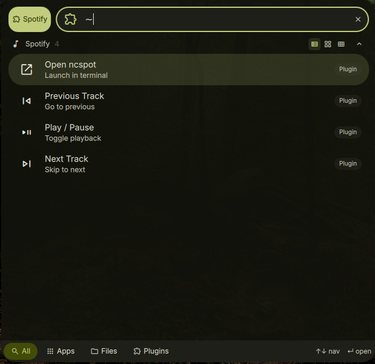

# DankSpotify

A launcher plugin for [DankMaterialShell](https://github.com/AvengeMedia/DankMaterialShell) that adds Spotify playback control and search to the DMS launcher.



## Features

- Play/pause, next, and previous track controls via playerctl
- Current track display with auto-refresh
- Search tracks by launching ncspot with pre-filled query
- Configurable player name, terminal emulator

## Installation

### Nix (flake)

Add as a `flake = false` input and include in your DMS plugin configuration:

```nix
inputs.dms-plugin-spotify = {
  url = "github:alcxyz/DankSpotify";
  flake = false;
};
```

```nix
programs.dank-material-shell.plugins.DankSpotify = {
  enable = true;
  src = inputs.dms-plugin-spotify;
};
```

### Manual

Copy the plugin directory to `~/.config/DankMaterialShell/plugins/DankSpotify/`.

## Usage

Activate with `~` (default trigger) in the DMS launcher, then:

- `~` — show current track and playback controls
- `~artist name` — open ncspot and search for "artist name"

## Requirements

- [playerctl](https://github.com/altdesktop/playerctl) — MPRIS media player control
- [ncspot](https://github.com/hrkfdn/ncspot) — Terminal Spotify client
- [wtype](https://github.com/atx/wtype) — Wayland keyboard input simulation

## License

MIT

<details>
<summary>Support</summary>

- **BTC:** `bc1pzdt3rjhnme90ev577n0cnxvlwvclf4ys84t2kfeu9rd3rqpaaafsgmxrfa`
- **ETH / ERC-20:** `0x2122c7817381B74762318b506c19600fF8B8372c`
</details>
